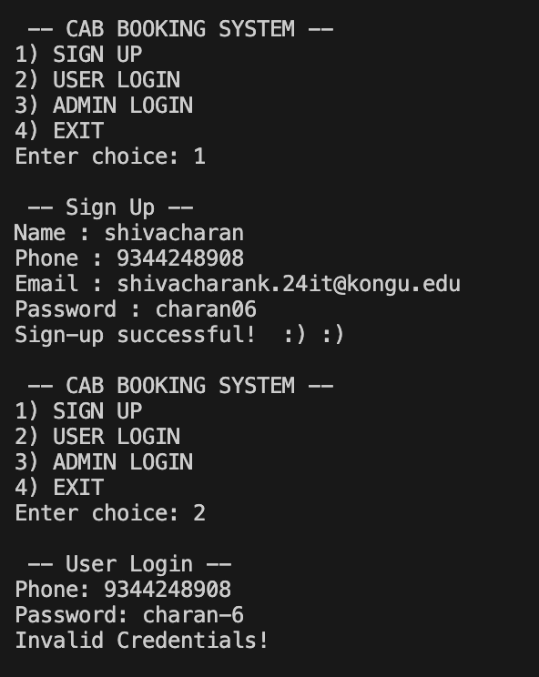
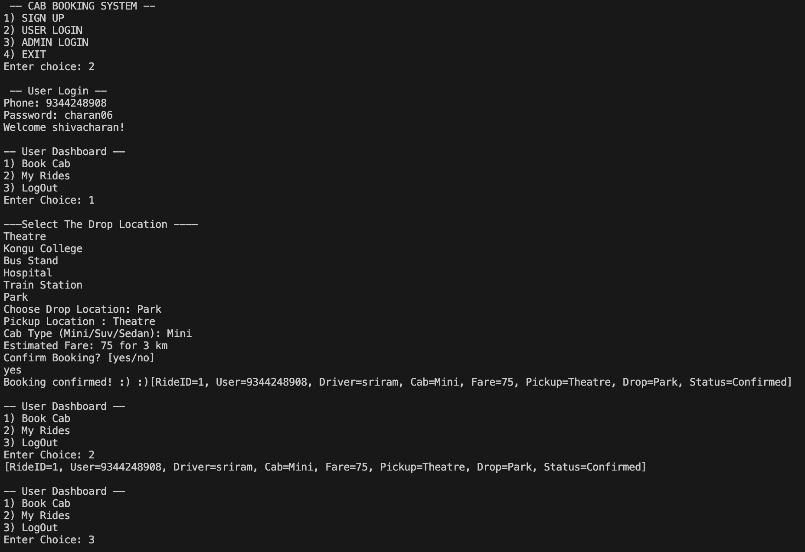
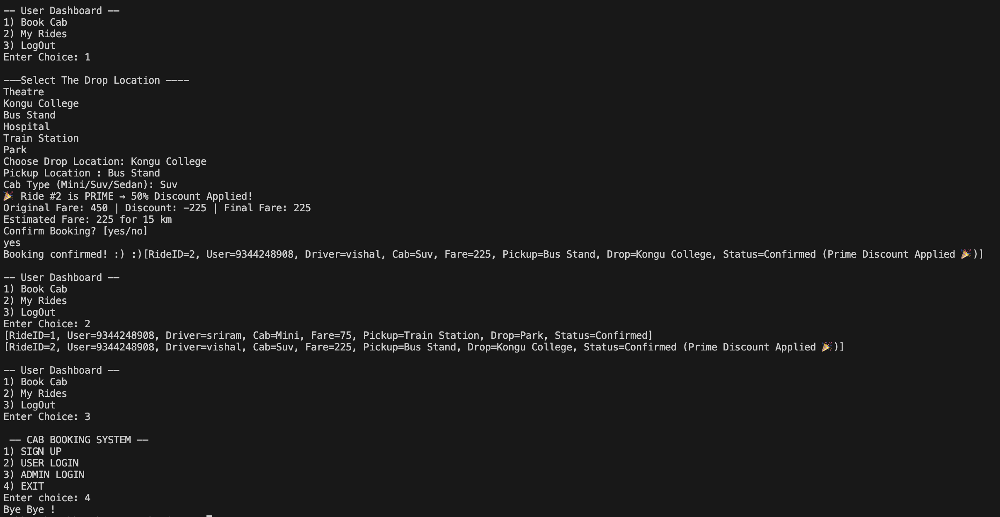

# 🚖 Cab Booking Management System – BYTE RUSH ’25 Hackathon  

A **console-based Cab Booking Management System** developed during the **BYTE RUSH ’25 Hackathon on Console Applications** organized by the **IT Association**.  
We proudly secured **🥈 2nd Place** in this competition! 🎉 

---

## 📌 Problem Statement  
Develop a **Cab Booking Management System** as a **console-based application**.  
The system must support:  
- Booking and canceling rides  
- Fare calculation with discounts  
- User ride history  
- Admin functionalities for monitoring bookings  

---

## ✨ Features Implemented  
- ✅ User login & registration  
- ✅ Book a cab (with cab availability check)  
- ✅ Cancel a booking anytime  
- ✅ View ride history  
- ✅ **Prime Discount** logic applied for eligible customers  
- ✅ Fare calculation with base + distance-based pricing  
- ✅ Admin login (`sukkanth / sukkanth07`)  
- ✅ Admin dashboard to view/manage all bookings  

---

## 🖥️ Sample Outputs  
## 🚖 Cab Booking System – Output Screenshots

| Admin Login & Add Driver | User Sign Up |
|--------------------------|--------------|
|           |  |

| User Sign In & Car Booking | Prime Discount |
|-----------------------------|----------------|
|              |  |

---

## ⚡ Tech Stack  
- **Language:** Java  
- **Paradigm:** Console-based application (No GUI)  
- **Editor Used:** VS Code  

---

## 🚀 Future Enhancements
- Add support for different cab types (Mini, Sedan, SUV)
- Implement dynamic pricing based on demand
- Store ride history in a database (instead of console only)
- Add payment gateway integration

  
---
## 👨‍💻 Team Members
- Sukkanth Muthukumar
- Shahin Raihaan A
